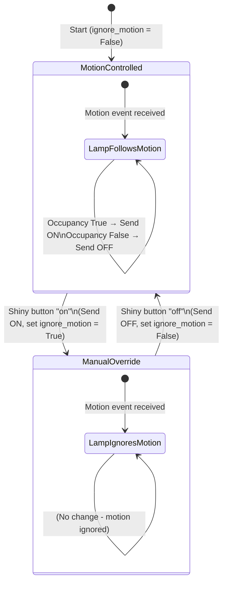

# IKEA Lightning Control

This project is a simple MQTT-based script (`mqtt_logger.py`) that integrates with Zigbee devices (via Zigbee2MQTT) to control a living room lamp based on motion sensors and a button (shiny_4_button). It logs device activity and handles automatic lamp control with manual overrides.

## Features
- Logs all Zigbee MQTT messages to `zigbee_activity.log`.
- Controls the living room lamp based on motion detection from the living room sensor.
- Allows manual override using the shiny button: pressing 'on' turns the lamp on and ignores motion; pressing 'off' turns it off and re-enables motion control.
- Prints device information when received on the configured topic.

## Requirements
- Python 3.x
- `paho-mqtt` library (install via `pip install paho-mqtt`)
- Access to an MQTT broker (e.g., from Zigbee2MQTT setup at `192.168.50.161:1883`)

## Setup
1. Clone the repository or copy the script to your machine.
2. Install dependencies:
   ```bash
   pip install paho-mqtt
   ```
3. Ensure your Zigbee devices are configured in Zigbee2MQTT with friendly names like `lamp_livingroom`, `shiny_4_button`, etc.
4. Update the MQTT broker address and ports in the script if needed.

## Usage
Run the script:
```bash
python mqtt_logger.py
```

The script will connect to the MQTT broker, subscribe to relevant topics, and start processing messages. It runs indefinitely until interrupted (e.g., Ctrl+C).

- Trigger motion in the living room to see the lamp turn on/off automatically (when not overridden).
- Press buttons on the shiny remote to manually control and override.

Logs are saved to `zigbee_activity.log`.

## Lighting Logic Statechart

The core logic revolves around whether to ignore the motion sensor or not, toggled by the shiny button. Below is a state machine diagram in Mermaid syntax (render it in a compatible viewer like mermaid.live, or in Markdown readers that support Mermaid such as GitHub or VS Code with extensions):



### Explanation
- **MotionControlled**: Lamp automatically follows motion sensor.
- **ManualOverride**: Motion is ignored after button 'on'; re-enabled after 'off'.

## Contributing
Feel free to fork and submit pull requests for improvements!

## License
MIT License (or specify your own). 